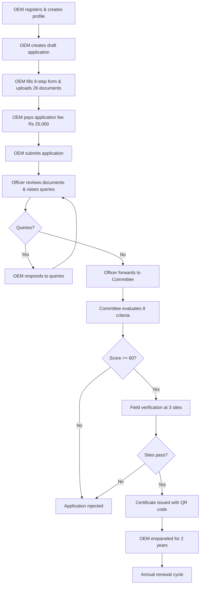
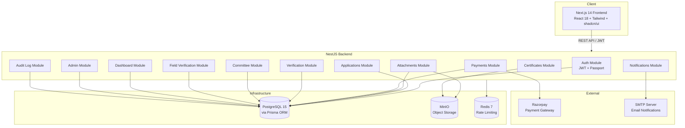
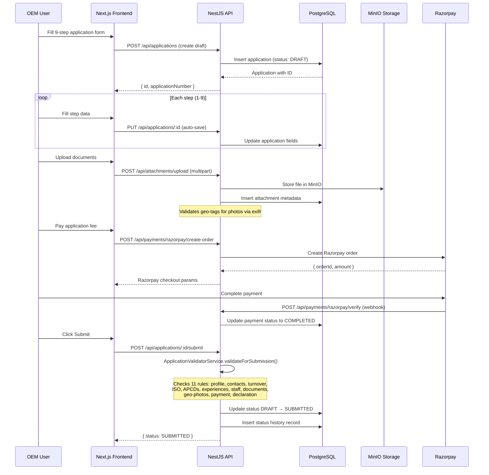
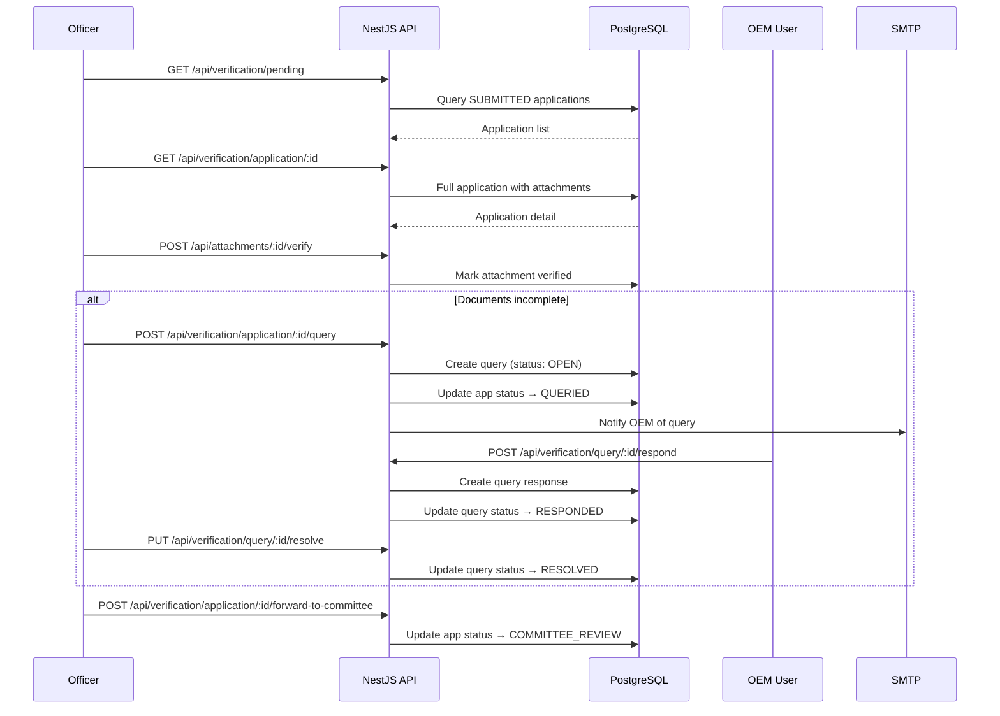
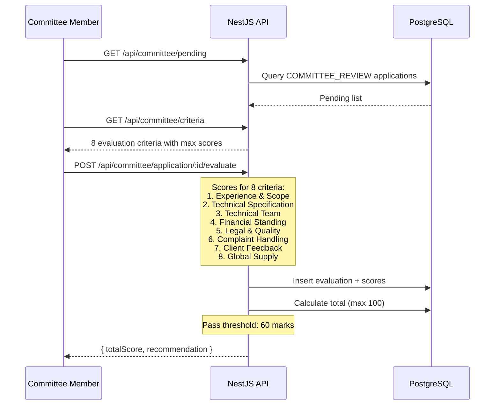
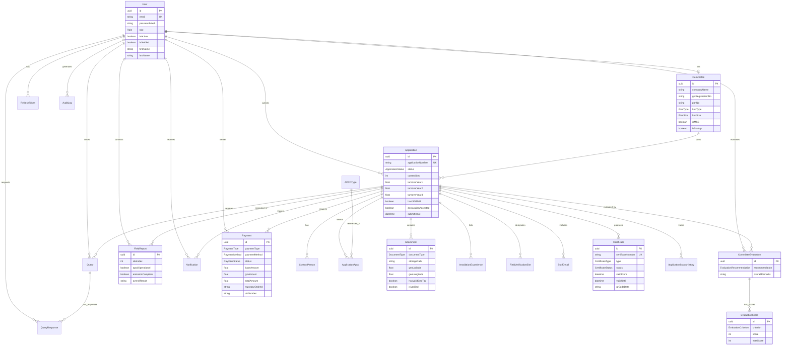

# APCD OEM Empanelment Portal -- High-Level Design (HLD)

## System Overview

### Purpose
The APCD (Air Pollution Control Devices) OEM Empanelment Portal is a web application built for the **National Productivity Council (NPC)** on behalf of the **Central Pollution Control Board (CPCB)**. It digitises the end-to-end empanelment lifecycle for manufacturers (OEMs) of air pollution control equipment in India.

Key capabilities:
- Multi-step application form with 26+ document uploads
- Role-based workflow spanning 7 user roles
- Committee-based evaluation with 8 scoring criteria
- On-site field verification with geo-tagged photo validation
- Integrated payment processing (Razorpay + manual NEFT/RTGS)
- QR-coded empanelment certificates with public verification
- Audit trail and notification system

### User Roles

| Role | Responsibility |
|------|---------------|
| **OEM** | Submits empanelment applications, uploads documents, pays fees, responds to queries |
| **OFFICER** | Reviews submitted applications, verifies documents, raises queries, forwards to committee |
| **COMMITTEE** | Evaluates applications on 8 criteria (100 marks, 60 passing threshold) |
| **FIELD_VERIFIER** | Conducts on-site inspections at 3 installation sites per application |
| **DEALING_HAND** | Manages lab testing bills, verifies manual NEFT/RTGS payments |
| **ADMIN** | Manages APCD master data, fee configuration, certificates, system reports |
| **SUPER_ADMIN** | Full system administration including user management |

### High-Level Application Flow



---

## Architecture Overview

The system is a **Turborepo monorepo** with two applications and three shared packages:

- **Frontend**: Next.js 14 (App Router) with React 18, Tailwind CSS, shadcn/ui
- **Backend**: NestJS 10 REST API with Prisma ORM
- **Database**: PostgreSQL 15
- **Object Storage**: MinIO (S3-compatible) for document uploads
- **Cache**: Redis 7 for rate limiting and session caching
- **Payment Gateway**: Razorpay for online payments



---

## Component Breakdown

### 1. Auth Module
- **Responsibility**: User registration (OEM only), login, JWT token management, password hashing, token refresh/revocation
- **Inputs**: Email/password credentials, refresh tokens
- **Outputs**: JWT access tokens (15m expiry), refresh tokens (7d expiry, stored in DB)
- **Key Dependencies**: bcryptjs, @nestjs/jwt, @nestjs/passport, PrismaService

### 2. Applications Module
- **Responsibility**: Full application lifecycle -- create, update (9-step auto-save), submit, resubmit, withdraw, status transitions
- **Inputs**: Multi-step form data (company profile, APCD selections, financial data, ISO certifications, declaration)
- **Outputs**: Application records with status tracking and audit history
- **Key Dependencies**: ApplicationValidatorService, FeeCalculatorService, PrismaService

### 3. Attachments Module
- **Responsibility**: Upload, download, verify, and manage 26 document types; geo-tag validation for factory photos
- **Inputs**: Multipart file uploads (max 10MB per file, 100MB total)
- **Outputs**: Stored files in MinIO with metadata (geo-coordinates, verification status)
- **Key Dependencies**: MinIO service, GeoTagValidatorService (exifr), Sharp (image processing)

### 4. Verification Module
- **Responsibility**: Officer document review workflow -- verify attachments, raise/resolve queries, forward to committee
- **Inputs**: Application ID, verification decisions, query subjects/descriptions
- **Outputs**: Verification status updates, queries with deadlines, status transitions
- **Key Dependencies**: PrismaService, NotificationsService

### 5. Committee Module
- **Responsibility**: 8-criterion evaluation by committee members (Experience, Technical Specs, Team, Financial, Legal, Complaint Handling, Client Feedback, Global Supply)
- **Inputs**: Scores per criterion (0-10), recommendation (APPROVE/REJECT/NEED_MORE_INFO/FIELD_VERIFICATION_REQUIRED)
- **Outputs**: Evaluation records, total score (max 100, pass threshold 60)
- **Key Dependencies**: PrismaService

### 6. Field Verification Module
- **Responsibility**: On-site inspection at 3 installation sites per application
- **Inputs**: Site visit data (APCD condition, emission readings, compliance checks)
- **Outputs**: Field reports with PASS/FAIL/CONDITIONAL results
- **Key Dependencies**: PrismaService

### 7. Payments Module
- **Responsibility**: Fee calculation (application Rs 25K, empanelment Rs 65K/APCD, 15% MSE discount, 18% GST), Razorpay integration, manual NEFT recording, payment verification
- **Inputs**: Payment method selection, Razorpay callbacks, NEFT UTR details
- **Outputs**: Payment records with status tracking
- **Key Dependencies**: Razorpay SDK, FeeCalculatorService, PrismaService

### 8. Certificates Module
- **Responsibility**: Generate QR-coded empanelment certificates (PDF), public verification endpoint, renewal, revocation
- **Inputs**: Approved application ID
- **Outputs**: PDF certificates with QR codes, 2-year validity
- **Key Dependencies**: pdfkit, qrcode, MinIO, PrismaService

### 9. Dashboard Module
- **Responsibility**: Role-specific KPI aggregation (pending items, completed actions, payment stats)
- **Inputs**: Authenticated user context
- **Outputs**: Dashboard data objects per role
- **Key Dependencies**: PrismaService

### 10. Admin Module
- **Responsibility**: User management, APCD type master data, fee configuration, system statistics, reports
- **Inputs**: Admin/SuperAdmin actions
- **Outputs**: CRUD results, aggregated statistics
- **Key Dependencies**: PrismaService

### 11. Notifications Module
- **Responsibility**: Triggered notifications for 10 event types (application submitted, queried, approved, etc.)
- **Inputs**: Event triggers from other modules
- **Outputs**: In-app notifications + email via Nodemailer
- **Key Dependencies**: Nodemailer (SMTP), PrismaService

### 12. Audit Log Module
- **Responsibility**: Record all system actions with before/after values for compliance
- **Inputs**: Interceptor-captured request data
- **Outputs**: Audit log entries with entity tracking
- **Key Dependencies**: AuditLogInterceptor, PrismaService

---

## Data Flow

### Flow 1: OEM Application Submission



### Flow 2: Officer Review and Query Cycle



### Flow 3: Committee Evaluation



---

## APIs & Integrations

### API Endpoints by Domain

| Domain | Method | Endpoint | Auth | Description |
|--------|--------|----------|------|-------------|
| **Auth** | POST | `/api/auth/register` | Public | OEM registration |
| | POST | `/api/auth/login` | Public | Email/password login |
| | POST | `/api/auth/refresh` | Public | Refresh access token |
| | GET | `/api/auth/me` | JWT | Get current user |
| | POST | `/api/auth/logout` | JWT | Revoke refresh tokens |
| **Applications** | POST | `/api/applications` | OEM | Create draft |
| | GET | `/api/applications` | JWT | List (role-filtered) |
| | GET | `/api/applications/:id` | JWT | Get detail |
| | PUT | `/api/applications/:id` | OEM | Update draft |
| | POST | `/api/applications/:id/submit` | OEM | Submit application |
| | POST | `/api/applications/:id/withdraw` | OEM | Withdraw |
| **Attachments** | POST | `/api/attachments/upload` | JWT | Upload document |
| | GET | `/api/attachments/:id` | JWT | Get metadata |
| | GET | `/api/attachments/:id/download` | JWT | Download file |
| | POST | `/api/attachments/:id/verify` | Officer | Verify document |
| **Verification** | GET | `/api/verification/pending` | Officer | Pending reviews |
| | GET | `/api/verification/application/:id` | Officer | Application detail |
| | POST | `/api/verification/application/:id/query` | Officer | Raise query |
| | POST | `/api/verification/query/:id/respond` | OEM | Respond to query |
| | PUT | `/api/verification/query/:id/resolve` | Officer | Resolve query |
| | POST | `/api/verification/application/:id/forward-to-committee` | Officer | Forward |
| **Committee** | GET | `/api/committee/pending` | Committee | Pending evaluations |
| | GET | `/api/committee/criteria` | Committee | Evaluation criteria |
| | POST | `/api/committee/application/:id/evaluate` | Committee | Submit evaluation |
| **Field Verification** | GET | `/api/field-verification/my-assignments` | Field Verifier | Assigned sites |
| | POST | `/api/field-verification/application/:id/report` | Field Verifier | Submit report |
| **Payments** | GET | `/api/payments/calculate/:applicationId` | OEM | Calculate fees |
| | POST | `/api/payments/razorpay/create-order` | OEM | Create Razorpay order |
| | POST | `/api/payments/razorpay/verify` | OEM | Verify payment |
| | POST | `/api/payments/manual` | OEM | Record NEFT payment |
| | PUT | `/api/payments/:id/verify` | Officer/DH | Verify manual payment |
| **Certificates** | GET | `/api/certificates` | JWT | List certificates |
| | GET | `/api/certificates/verify/:number` | Public | Public verification |
| | POST | `/api/certificates/:id/revoke` | Admin | Revoke certificate |
| **Admin** | GET | `/api/admin/users` | Admin | User list |
| | GET | `/api/admin/fees` | Admin | Fee configuration |
| | GET | `/api/admin/stats` | Admin | System statistics |
| **Dashboard** | GET | `/api/dashboard/:role` | JWT | Role-specific dashboard |

### Authentication & Security
- **JWT Authentication**: Access tokens (15m) + refresh tokens (7d, DB-stored, revocable)
- **Password Policy**: 8+ characters, uppercase, lowercase, number, special character
- **Password Hashing**: bcryptjs with salt rounds = 12
- **Role-Based Access Control**: `@Roles()` decorator + `RolesGuard` on every protected endpoint
- **Rate Limiting**: @nestjs/throttler (100 requests/60s default)
- **Security Headers**: Helmet middleware
- **CORS**: Configured per environment
- **Global Exception Filter**: Standardized error responses with no stack trace leaks

### External Services

| Service | Purpose | Configuration |
|---------|---------|---------------|
| **Razorpay** | Online payment processing | `RAZORPAY_KEY_ID`, `RAZORPAY_KEY_SECRET`, `RAZORPAY_WEBHOOK_SECRET` |
| **SMTP (Nodemailer)** | Email notifications | `SMTP_HOST`, `SMTP_PORT`, `SMTP_USER`, `SMTP_PASS` |
| **MinIO** | S3-compatible document storage | `MINIO_ENDPOINT`, `MINIO_ACCESS_KEY`, `MINIO_SECRET_KEY`, `MINIO_BUCKET` |
| **Redis** | Rate limiting, caching | `REDIS_URL` |

---

## Database Schema

### Entity Relationship Diagram



### Key Entities (22 tables)

| Entity | Records | Purpose |
|--------|---------|---------|
| User | 7 roles | All system users |
| RefreshToken | Per session | JWT refresh tokens |
| OemProfile | 1 per OEM | Company details (fields 1-14) |
| ContactPerson | 2 per app | Commercial + technical contacts |
| Application | Core entity | 9-step form with 18 status values |
| ApplicationStatusHistory | Audit | Status transition log |
| APCDType | Master data | 7 APCD categories with subtypes |
| ApplicationApcd | Junction | APCD selections per application |
| Attachment | 26 types | Uploaded documents with geo-tags |
| InstallationExperience | Min 3/APCD | Past installation proof (Annexure 6a) |
| FieldVerificationSite | 3 per app | Sites for on-site inspection (Annexure 6b) |
| StaffDetail | Min 2 eng | Technical team (Annexure 7) |
| Query | Per issue | Officer/committee queries |
| QueryResponse | Per query | OEM responses |
| CommitteeEvaluation | Per member | 8-criterion evaluation |
| EvaluationScore | Per criterion | Individual scores |
| FieldReport | Per site | On-site inspection results |
| Payment | Per fee type | Razorpay + manual payments |
| Certificate | Per approval | QR-coded empanelment certificates |
| AuditLog | All actions | Compliance audit trail |
| Notification | Per event | In-app + email notifications |
| FeeConfiguration | Per type | Fee amounts and GST rates |

---

## Deployment & Environment

### Local Development
```bash
# Prerequisites: Node 20+, pnpm 9+, Docker
docker-compose up -d          # PostgreSQL, MinIO, Redis
pnpm install
pnpm db:generate && pnpm db:seed
pnpm dev                      # Starts API on :4000, Web on :3000
```

### Docker Deployment
- **API**: Multi-stage Alpine build with esbuild-compiled seed script
- **Web**: Multi-stage Next.js standalone build
- **docker-compose.yml**: Full stack (PostgreSQL 15, MinIO, Redis 7, API, Web)

### Production (Railway)
- Auto-deploy on push to `master` branch
- Dockerfile-based builds
- Environment variables configured per service
- `CMD` runs migrations + seed + application start

### Environment Variables (key ones)

| Variable | Required | Default | Purpose |
|----------|----------|---------|---------|
| `DATABASE_URL` | Yes | -- | PostgreSQL connection string |
| `JWT_SECRET` | Yes | -- | JWT signing secret |
| `JWT_ACCESS_EXPIRY` | No | `15m` | Access token TTL |
| `MINIO_ENDPOINT` | Yes | -- | Object storage host |
| `MINIO_ACCESS_KEY` | Yes | -- | MinIO credentials |
| `MINIO_SECRET_KEY` | Yes | -- | MinIO credentials |
| `RAZORPAY_KEY_ID` | Yes | -- | Payment gateway key |
| `RAZORPAY_KEY_SECRET` | Yes | -- | Payment gateway secret |
| `SMTP_HOST` | No | -- | Email server |
| `REDIS_URL` | No | -- | Redis for rate limiting |
| `SEED_SECRET` | No | `apcd-seed-2025` | CI/CD test user reset |

---

## Non-Functional Requirements

### Performance
- API response time: < 500ms for standard CRUD, < 2s for report generation
- File upload: Support up to 10MB per file, 100MB total per application
- Database: Indexed on `status`, `applicantId`, `applicationNumber`, `documentType`

### Scalability
- Stateless API design (JWT-based, no server sessions)
- MinIO for horizontally scalable object storage
- Redis for distributed rate limiting
- Database connection pooling via Prisma

### Reliability
- Database migrations via Prisma Migrate (idempotent `deploy`)
- Refresh token rotation (old token revoked on use)
- Audit log for all state-changing operations

### Security
- OWASP-aligned: input validation (class-validator), parameterized queries (Prisma), no raw SQL
- Helmet security headers
- Rate limiting (100 req/60s)
- File type validation on uploads
- No password or secret logging

### Observability
- Structured error responses (HttpExceptionFilter)
- Audit log interceptor captures all mutations
- Console logging for unhandled exceptions with stack traces

---

## Key Design Decisions

| Decision | Choice | Rationale |
|----------|--------|-----------|
| **API Style** | REST | Fits CRUD-heavy domain; simpler than GraphQL for document workflows |
| **Architecture** | Modular monolith (NestJS) | Right complexity for the team size; modules are well-separated for future extraction |
| **ORM** | Prisma | Type-safe queries, excellent migration system, good DX |
| **Auth** | JWT + DB-stored refresh tokens | Stateless access tokens + revocable refresh tokens balances performance and security |
| **File Storage** | MinIO (S3-compatible) | Self-hosted, cheaper than AWS S3 for government use; easy to swap to S3 later |
| **Monorepo** | Turborepo + pnpm | Shared types/constants between frontend and backend; parallel builds |
| **Frontend State** | Zustand + React Query | Zustand for auth state; React Query for server state caching |
| **Payments** | Razorpay + manual NEFT | Razorpay for online; manual NEFT for government payment workflows |
| **Password Hashing** | bcryptjs (pure JS) | Docker Alpine compatibility; identical output format to native bcrypt |
| **E2E Testing** | Playwright | Cross-browser support, reliable selectors, parallel execution |

### Trade-offs and Known Limitations
- **No real-time updates**: Polling-based; WebSocket/SSE could be added for notifications
- **Single database**: No read replicas; sufficient for current scale (~1000 OEMs)
- **Email-only notifications**: SMS integration is stubbed but not implemented
- **No CDN**: Static assets served by Next.js; CDN can be added in front
- **Certificate PDF**: Generated server-side via pdfkit; no template customization UI

---

## Guidelines for Future Changes

### Adding New Features
1. **New API module**: Create under `apps/api/src/modules/<name>/` with controller, service, module, and DTOs
2. **New frontend page**: Create under `apps/web/src/app/<route>/page.tsx` using the existing dashboard layout
3. **New database entity**: Add to `packages/database/prisma/schema.prisma`, run `pnpm db:migrate`
4. **New shared types**: Add to `packages/shared/src/types/` and re-export from `index.ts`

### Avoiding Breaking Changes
- Never modify existing API response shapes without versioning or feature flags
- Always add new columns as optional (nullable) to avoid migration failures
- Run `pnpm type-check` before committing to catch cross-package breakage
- Keep the `@Public()` decorator explicit -- never remove auth from protected endpoints

### Pre-Merge Checklist
1. `pnpm lint` passes
2. `pnpm type-check` passes
3. `pnpm test` passes (unit tests)
4. Integration tests pass if API boundaries were touched
5. E2E tests pass if user-visible flows changed
6. `docs/HLD.md` and `docs/LLD.md` updated if architecture changed
7. Database migration created and tested if schema changed
8. No secrets in committed code (check `.env.example` instead)
